To get better at extracting meaningful insights from data, I was poking around for project ideas to improve my data wrangling and visualization skills in R. [TidyTuesday](https://github.com/rfordatascience/tidytuesday) had an interesting dataset about [NYC Restaurant Inspections](https://github.com/rfordatascience/tidytuesday/tree/master/data/2018/2018-12-11). Being a Chicago resident, I wanted to find out if the [City of Chicago](https://data.cityofchicago.org/) had a similar dataset. [Food Inspections](https://data.cityofchicago.org/Health-Human-Services/Food-Inspections/4ijn-s7e5) provided just what I was looking for. 

I downloaded the dataset and could see that it had information about inspections from January 2010 to February 2020. According to the [notes](http://dev.cityofchicago.org/open%20data/data%20portal/2018/06/29/food-violations-changes.html) from the website, there was a major change in the way violations were recorded in the database starting from July 2018. For the purpose of maintaining uniformity in the analysis, I have decided to use 6 full years of data from January 2012 to December 2017.

#### Introduction

Having made note of the disclaimer on the website that the dataset could include duplicate inspection reports, I examined inspection_ids for duplicates but could not find any. I could not find duplicates for a combination of the aka_name and the inspection_date either (there were a lot of nulls for the name but that's probably not what the disclaimer meant). For now I am going to assume that there are no duplicates in this dataset as the disclaimer is a little ambiguous on how the data could be duplicated.     


Unlike the NYC dataset in TidyTuesday, this contains food inspections across various **Facilities**. Restaurants constitute majority of the inspections in the data with about 69% from this category, roughly about 86,000 in 6 years. Grocery Stores are a distant second with about 13%. Other categories include Schools, Bakeries, Daycares etc. In this analysis, I will be looking at just the inspections in **Restaurants**. 


```r
food_inspections_filtered_df %>% 
  mutate(total_num_inspections = n()) %>% 
  group_by(facility_type) %>% 
  summarise(num_inspections = n(),
            total_inspections = max(total_num_inspections),
            pct_inspections = paste0(round(num_inspections*100/total_inspections,1), "%")) %>% 
  arrange(desc(num_inspections)) %>% 
  top_n(n = 10) %>% 
  ggplot(aes(x=reorder(facility_type, num_inspections), y = num_inspections))+
  geom_col()+
  geom_text(aes(label = pct_inspections), hjust = -0.05, size=4.5)+
  labs(y='Total Number of Inspections',
       x='',
       title="Chicago City Food Inspections: Top 10 Facility Types",
       subtitle = "Jan '12 to Dec '17",
       caption = "data.cityofchicago.org")+
  scale_x_discrete(labels = function(x) str_wrap(x, width = 22))+
  scale_y_continuous(breaks = seq(0, 100000, by=10000), labels = comma)+
  coord_flip()+
  theme_bw(base_size = 18)
```

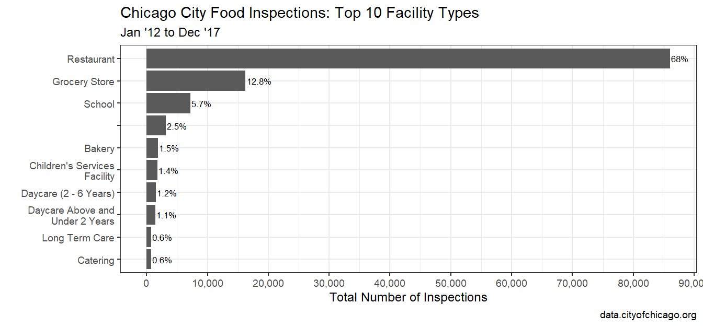<!-- -->


#### Restaurants, Inspections and Outcomes {.tabset .tabset-fade .tabset-pills}


```r
food_inspections_restaurants_df <- food_inspections_filtered_df %>% 
  filter(facility_type == 'Restaurant') %>% 
  mutate(inspection_date = mdy(inspection_date))
```

##### Outcomes

There are 7 different events that can happen after the inspection. Three major ones which are going to be focused on are **Pass, Pass with Conditions and Fail** as these constitute roughly about 87% of the total share.


```r
food_inspections_restaurants_df %>% 
  mutate(total_num_inspections = n()) %>% 
  group_by(results) %>% 
  summarise(num_inspections = n(),
            total_inspections = max(total_num_inspections),
            pct_inspections = paste0(round(num_inspections*100/total_inspections,1), "%")) %>% 
  ggplot(aes(x=reorder(results, num_inspections), y = num_inspections))+
  geom_col()+
  geom_text(aes(label = pct_inspections), hjust = -0.05, size=4.5)+
  labs(y='Total Number of Inspections',
       x='',
       title="Outcome of Food Inspections in Restaurants",
       caption = "data.cityofchicago.org")+
  scale_x_discrete(labels = function(x) str_wrap(x, width = 22))+
  scale_y_continuous(breaks = seq(0, 100000, by=10000), labels = comma)+
  coord_flip()+
  theme_bw(base_size = 18)
```

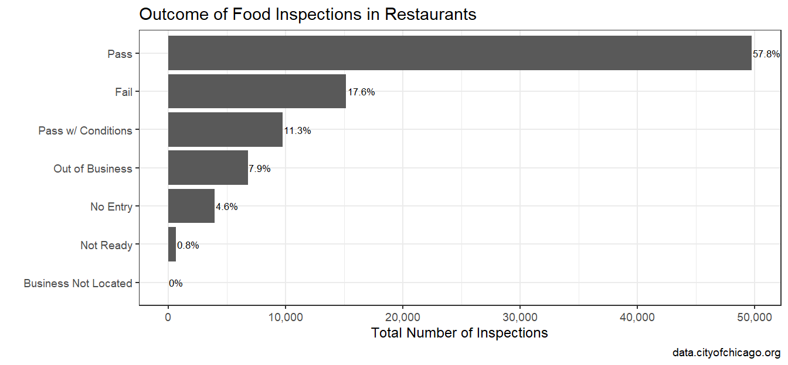<!-- -->

##### Inspection Types

**Canvas** is the routine type of inspection that is performed most commonly as we can see from the data. 56% of all inspections are of type **Canvas**, followed by 12% of **Canvass Re-Inspection**. The city makes sure that the food establishments are safe for the citizens, so conducts unannounced inspections periodically. 10% of the  inspections are of type **License** which is done on a restaurant before granting the permission to operate. Two other reasons for inspections are **Complaint** and **Complaint Re-Inspection**, as a response to a complaint made on the restaurant. 


```r
food_inspections_restaurants_df %>% 
  mutate(total_num_inspections = n()) %>% 
  group_by(inspection_type) %>% 
  summarise(num_inspections = n(),
            total_inspections = max(total_num_inspections),
            pct_inspections = paste0(round(num_inspections*100/total_inspections,1), "%")) %>% 
  arrange(desc(num_inspections)) %>% 
  top_n(n = 10) %>% 
  ggplot(aes(x=reorder(inspection_type, num_inspections), y = num_inspections))+
  geom_col()+
  geom_text(aes(label = pct_inspections), hjust = -0.05, size=4.5)+
  labs(y='Total Number of Inspections',
       x='',
       title="Types of Inspections in Restaurants",
       caption = "data.cityofchicago.org")+
  scale_x_discrete(labels = function(x) str_wrap(x, width = 22))+
  scale_y_continuous(breaks = seq(0, 80000, by=5000), labels = comma)+
  coord_flip()+
  theme_bw(base_size = 18)
```

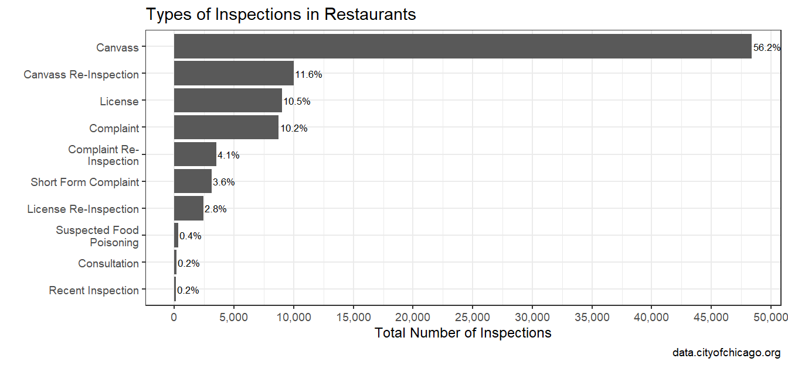<!-- -->

##### Risk Levels

As expected, there are more inspections which occur in restaurants which have the **highest Risk** compared to those that have **medium Risk** and **low Risk**.

I used the [wrap_plots](https://www.rdocumentation.org/packages/patchwork/versions/1.0.0/topics/wrap_plots) function from the package [patchwork](https://cran.r-project.org/web/packages/patchwork/index.html) to combine these two plots together. It's a cool package that I will definitely explore a lot more in the future!


```r
p1 <- food_inspections_restaurants_df %>% 
  mutate(total_num_inspections = n()) %>% 
  group_by(risk) %>% 
  summarise(num_inspections = n(),
            total_inspections = max(total_num_inspections),
            pct_inspections = paste0(round(num_inspections*100/total_inspections,1), "%")) %>% 
  arrange(desc(num_inspections)) %>% 
  ggplot(aes(x=reorder(risk, num_inspections), y = num_inspections))+
  geom_col()+
  geom_text(aes(label = pct_inspections), vjust = -0.05, size=4)+
  labs(y='# of Inspections',
       x='',
       title="Types of Risks",
       caption = "data.cityofchicago.org")+
  scale_y_continuous(breaks = seq(0, 80000, by=20000), labels = comma)+
  theme_bw(base_size = 16)

p2 <- food_inspections_restaurants_df %>% 
  filter(results %in% c('Pass', 'Pass w/ Conditions', 'Fail')) %>% 
  mutate(inspection_month = floor_date(inspection_date, "month")) %>% 
  filter(!risk %in% c('', 'All')) %>% 
  group_by(inspection_month, results, risk) %>% 
  summarise(total_inspections = n()) %>% 
  ggplot(aes(x=inspection_month, y = total_inspections))+
  geom_line(aes(group=results, color = results))+
  facet_grid(vars(risk))+
    labs(title = "Inspections by Risk Category",
       caption = "data.cityofchicago.org",
       x = "",
       y = "",
       color = "Outcome")+
  theme_bw(base_size = 15)+
  theme(legend.position = "bottom", legend.direction = "horizontal")

wrap_plots(p1, p2)
```

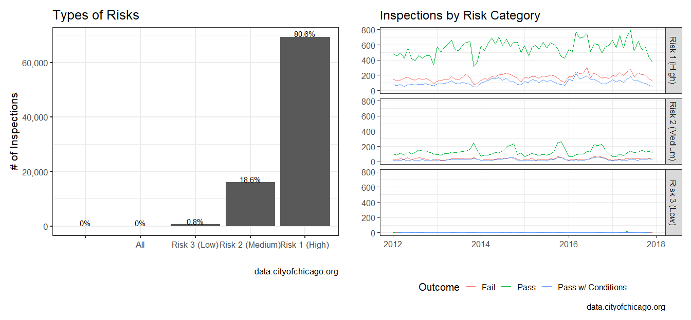<!-- -->


##### Inspection Types & Risk Levels

I filtered the Top 5 Inspection Types to see how the Inspection Types are spread across the three Risk Levels.

High Risk Restaurants get the most number of routine inspections. They also get the most number of inspections because of complaints . 


```r
top_5_inspection_types_df <- food_inspections_restaurants_df %>% 
    filter(results %in% c('Pass', 'Pass w/ Conditions', 'Fail'),
         !risk %in% c('', 'All')) %>% 
  mutate(total_num_inspections = n()) %>% 
  group_by(inspection_type) %>% 
  summarise(num_inspections = n(),
            total_inspections = max(total_num_inspections),
            pct_inspections = paste0(round(num_inspections*100/total_inspections,1), "%")) %>% 
  arrange(desc(num_inspections)) %>% 
  top_n(n = 5) %>% 
  select(inspection_type)

food_inspections_restaurants_df %>% 
  filter(results %in% c('Pass', 'Pass w/ Conditions', 'Fail'),
         !risk %in% c('', 'All')) %>% 
  mutate(total_num_inspections = n()) %>% 
  group_by(inspection_type, risk) %>% 
  summarise(num_inspections = n(),
            total_inspections = max(total_num_inspections),
            pct_inspections = paste0(round(num_inspections*100/total_inspections,1), "%")) %>% 
  filter(inspection_type %in% top_5_inspection_types_df$inspection_type) %>% 
  ggplot(aes(x=reorder(inspection_type, num_inspections), y = num_inspections))+
  geom_col()+
  geom_text(aes(label = pct_inspections), hjust = -0.05, size=4.5)+
  labs(y='Total Number of Inspections',
       x='',
       title="Outcome of Food Inspections in Restaurants",
       caption = "data.cityofchicago.org")+
  scale_x_discrete(labels = function(x) str_wrap(x, width = 22))+
  scale_y_continuous(breaks = seq(0, 100000, by=10000), labels = comma)+
  facet_grid(vars(risk))+
  coord_flip()+
  theme_bw(base_size = 18)
```

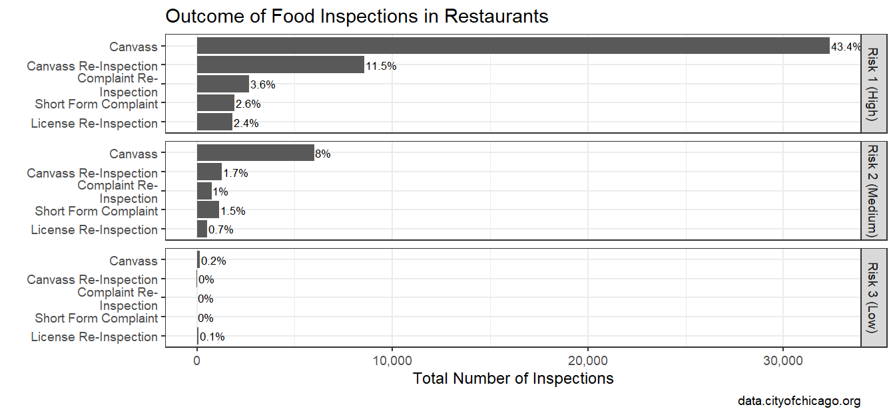<!-- -->

##### Outcomes over Time

We can see that Resuaurants that **Pass** the inspections has decreased slightly year over year. Correspondingly, there is a slight increase in those with the outcome **Pass with Conditions** and **Fail**.


```r
food_inspections_restaurants_df %>% 
  filter(results %in% c('Pass', 'Pass w/ Conditions', 'Fail')) %>% 
  mutate(inspection_month = floor_date(inspection_date, unit = "month")) %>% 
  group_by(inspection_month, results) %>% 
  summarise(ncount = n()) %>% 
  spread(results, ncount) %>% 
  ungroup() %>% 
  mutate(totalcount = rowSums(.[2:4], na.rm=TRUE)) %>% 
  gather(key = "type", value = "count", -inspection_month, -totalcount) %>% 
  mutate(pct = count/totalcount) %>% 
  ggplot(aes(x=inspection_month, y = pct))+
  geom_line(aes(color=type))+
  scale_x_date(date_breaks = "12 months", date_labels = "%b '%y")+
  scale_y_continuous(labels = percent)+
  labs(title = "Distribution of the Results of Inspection over Time",
       caption = "data.cityofchicago.org",
       x = "",
       y = "",
       color = "Result")+
  theme_bw()
```

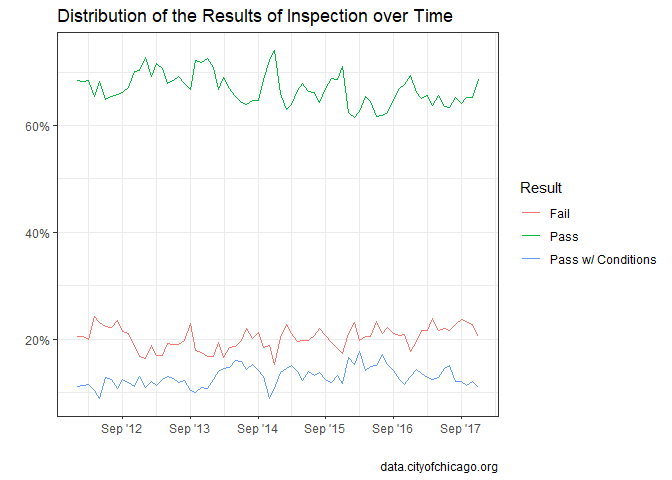<!-- -->

##### Outcomes by Months

In more recent years ('15, '16 and '17), there is a slight downward trend in the number of inspections that result in **Pass** and a slight uptick in **Fail**. For example, looking at the trend for each year during January, February and March, we can see the decrease in the percentage of inspections where the Restaurant passed the test. Correspondingly, there is a slight increase in **Fail** and **Pass with Conditions** for these months.


```r
food_inspections_restaurants_df %>% 
  filter(results %in% c('Pass', 'Pass w/ Conditions', 'Fail')) %>% 
  mutate(inspection_month = floor_date(inspection_date, unit = "month"),
         mth = month(inspection_month, label = TRUE),
         yr = paste0("'", year(inspection_month) %% 100)) %>% 
  group_by(mth, yr, results) %>% 
  summarise(ncount = n()) %>% 
  spread(results, ncount) %>% 
  ungroup() %>% 
  mutate(totalcount = rowSums(.[3:5], na.rm=TRUE)) %>% 
  gather(key = "type", value = "count", -mth, -yr, -totalcount) %>% 
  mutate(pct = round((count/totalcount)*100, 1)) %>% 
  ggplot(aes(x=yr, y = pct))+
  geom_line(aes(color=type, group = type))+
  facet_wrap(~mth) +
  labs(title = "Outcome of Inspections Over Time for each Month",
       caption = "Data from data.cityofchicago.org",
       x = "Inspection Year",
       y = "Percentage of Inspections",
       color = "Result")+
  theme_bw(base_size = 18)
```

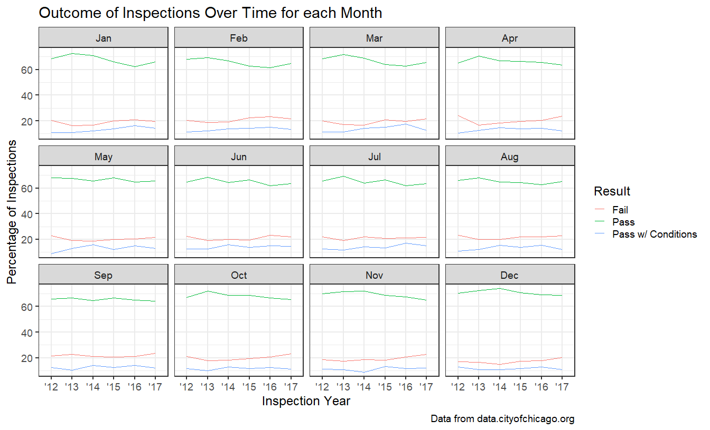<!-- -->

#### Inspections in Chicago Land Area

To explore more about inspections in the Chicagoland area, I got the dataset mapping the Zipcodes to Neighborhoods and Regions in the area from [here](https://www.seechicagorealestate.com/chicago-zip-codes-by-neighborhood.php). 

Here's the top 6 rows from the dataset. All the zipcodes belonging to a particular neighborhood are in one row.


```r
kable(head(chicago_neighborhoods_raw_df)) %>% 
  kable_styling(full_width = F)
```

<table class="table" style="width: auto !important; margin-left: auto; margin-right: auto;">
 <thead>
  <tr>
   <th style="text-align:left;"> neighborhood </th>
   <th style="text-align:left;"> zip </th>
   <th style="text-align:left;"> region </th>
  </tr>
 </thead>
<tbody>
  <tr>
   <td style="text-align:left;"> Cathedral District </td>
   <td style="text-align:left;"> 60611 </td>
   <td style="text-align:left;"> Downtown </td>
  </tr>
  <tr>
   <td style="text-align:left;"> Central Station </td>
   <td style="text-align:left;"> 60605 </td>
   <td style="text-align:left;"> Downtown </td>
  </tr>
  <tr>
   <td style="text-align:left;"> Dearborn Park </td>
   <td style="text-align:left;"> 60605 </td>
   <td style="text-align:left;"> Downtown </td>
  </tr>
  <tr>
   <td style="text-align:left;"> Gold Coast </td>
   <td style="text-align:left;"> 60610, 60611 </td>
   <td style="text-align:left;"> Downtown </td>
  </tr>
  <tr>
   <td style="text-align:left;"> Loop </td>
   <td style="text-align:left;"> 60601, 60602, 60603, 60604, 60605, 60606, 60607, 60616 </td>
   <td style="text-align:left;"> Downtown </td>
  </tr>
  <tr>
   <td style="text-align:left;"> Magnificent Mile </td>
   <td style="text-align:left;"> 60611 </td>
   <td style="text-align:left;"> Downtown </td>
  </tr>
</tbody>
</table>


[separate_rows](https://tidyr.tidyverse.org/reference/separate_rows.html) is an excellent function to the rescue here! I was able to separate them out the way I wanted and could group_by region.

**Downtown** has the highest number of percentage of inspections which indicates that there are a large number of restaurants. **North Side** comes as a close second. 


```r
chicago_neighborhoods_df <- chicago_neighborhoods_raw_df %>% 
  separate_rows(zip)

food_inspections_restaurants_df %>% 
  mutate(zip = as.character(zip)) %>% 
  left_join(chicago_neighborhoods_df, by = "zip") %>% 
  filter(results %in% c('Pass', 'Pass w/ Conditions', 'Fail'),
         ! risk %in% c('', 'All')) %>% 
  mutate(inspection_month = floor_date(inspection_date, unit = "month"),
         mth = month(inspection_month, label = TRUE),
         yr = paste0("'", year(inspection_month) %% 100)) %>% 
  group_by(yr) %>% 
  mutate(total_inspections = n()) %>% 
  ungroup() %>% 
  group_by(region, yr) %>% 
  summarise(num_inspections = n(),
            num_fail = sum(ifelse(results == 'Fail', 1, 0)),
            num_pass = sum(ifelse(results == 'Pass', 1, 0)),
            num_pass_wc = sum(ifelse(results == 'Pass w/ Conditions', 1, 0)),
            total = num_fail+num_pass+num_pass_wc,
            pct = total/first(total_inspections),
            pass_rate = num_pass/total,
            fail_rate = num_fail/total,
            pass_wc_rate = num_pass_wc/total) %>% 
  ggplot(aes(x=yr, y = pct))+
  geom_line(aes(color = region, group = region))+
  scale_y_continuous(labels = percent)+
  labs(title = "Inspections in Chicagoland",
       caption = "Data from data.cityofchicago.org",
       x = "Inspection Year",
       y = "Percentage of Inspections",
       color = "Region")+
  theme_bw()
```

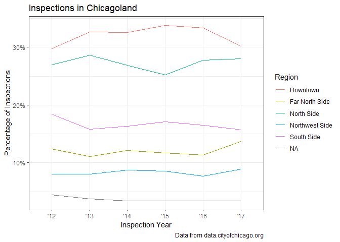<!-- -->

#### Where CAN you eat?

Downtown has the highest number of inspections among all the three Risk Levels - High, Medium and Low. 33% of <span style="color:red">High Risk</span> Restaurant inspections, 30% of <span style="color:orange">Medium Risk</span> inspections and a whopping 43% of <span style="color:green">Low Risk </span> inspections happen in Downtown. It's where a lot of the people work, they get their everyday lunches or have business lunches all around the region. North Side has 28%, 26% and 24% of restaurant inspections for High, Medium and Low Risk respectively. 


```r
chicago_neighborhoods_df <- chicago_neighborhoods_raw_df %>% 
  separate_rows(zip)

food_inspections_restaurants_df %>% 
  mutate(zip = as.character(zip)) %>% 
  left_join(chicago_neighborhoods_df, by = "zip") %>% 
  filter(results %in% c('Pass', 'Pass w/ Conditions', 'Fail'),
         ! risk %in% c('', 'All')) %>% 
  mutate(inspection_month = floor_date(inspection_date, unit = "month"),
         mth = month(inspection_month, label = TRUE),
         yr = paste0("'", year(inspection_month) %% 100)) %>% 
  group_by(risk) %>% 
  mutate(total_inspections = n()) %>% 
  ungroup() %>% 
  group_by(region, risk) %>% 
  summarise(num_inspections = n(),
            num_fail = sum(ifelse(results == 'Fail', 1, 0)),
            num_pass = sum(ifelse(results == 'Pass', 1, 0)),
            num_pass_wc = sum(ifelse(results == 'Pass w/ Conditions', 1, 0)),
            total = num_fail+num_pass+num_pass_wc,
            pct = total/first(total_inspections),
            pass_rate = num_pass/total,
            fail_rate = num_fail/total,
            pass_wc_rate = num_pass_wc/total) %>% 
  ggplot(aes(x=risk, y = pct, fill=region, label = round(pct*100,1)))+
  geom_col()+
  geom_text(size = 3, position = position_stack(vjust = 0.5))+
  scale_y_continuous(labels = percent)+
  labs(title = "Inspections by Risk Levels in Different Regions",
       caption = "Data from data.cityofchicago.org",
       x = "Risk",
       y = "Share",
       color = "Region")+
  theme_bw()
```

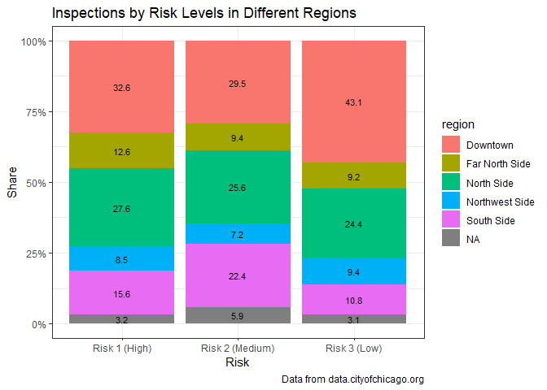<!-- -->

#### How is your Neighborhood?

I filtered the top 10 Neighborhoods (by total number of inspections) to explore more about them. Over the past few years, number of inspections in **South Loop** have been increasing! Something to fear?


```r
chicago_neighborhoods_df <- chicago_neighborhoods_raw_df %>% 
  separate_rows(zip)

top_n_neighborhoods <- food_inspections_restaurants_df %>% 
  mutate(zip = as.character(zip)) %>% 
  left_join(chicago_neighborhoods_df, by = "zip") %>% 
  filter(results %in% c('Pass', 'Pass w/ Conditions', 'Fail'),
         ! risk %in% c('', 'All')) %>% 
  mutate(inspection_month = floor_date(inspection_date, unit = "month"),
         mth = month(inspection_month, label = TRUE),
         yr = paste0("'", year(inspection_month) %% 100)) %>% 
  group_by(neighborhood) %>% 
  summarise(total_inspections = n()) %>% 
  arrange(desc(total_inspections)) %>% 
  top_n(n=10)

food_inspections_restaurants_df %>% 
  mutate(zip = as.character(zip)) %>% 
  left_join(chicago_neighborhoods_df, by = "zip") %>% 
  filter(results %in% c('Pass', 'Pass w/ Conditions', 'Fail'),
         ! risk %in% c('', 'All')) %>% 
  mutate(inspection_month = floor_date(inspection_date, unit = "month"),
         mth = month(inspection_month, label = TRUE),
         yr = paste0("'", year(inspection_month) %% 100)) %>% 
  group_by(yr) %>% 
  mutate(total_inspections = n()) %>% 
  ungroup() %>% 
  group_by(neighborhood, yr) %>% 
  summarise(num_inspections = n(),
            num_fail = sum(ifelse(results == 'Fail', 1, 0)),
            num_pass = sum(ifelse(results == 'Pass', 1, 0)),
            num_pass_wc = sum(ifelse(results == 'Pass w/ Conditions', 1, 0)),
            total = num_fail+num_pass+num_pass_wc,
            pct = total/first(total_inspections),
            pass_rate = num_pass/total,
            fail_rate = num_fail/total,
            pass_wc_rate = num_pass_wc/total) %>% 
  filter(neighborhood %in% top_n_neighborhoods$neighborhood) %>% 
  ggplot(aes(x=yr, y = pct))+
  geom_line(aes(color = neighborhood, group = neighborhood))+
  scale_y_continuous(labels = percent)+
  labs(title = "Inspections in Different Neighborhoods",
       caption = "Data from data.cityofchicago.org",
       x = "Inspection Year",
       y = "Share",
       color = "Neighborhood")+
  theme_bw()
```

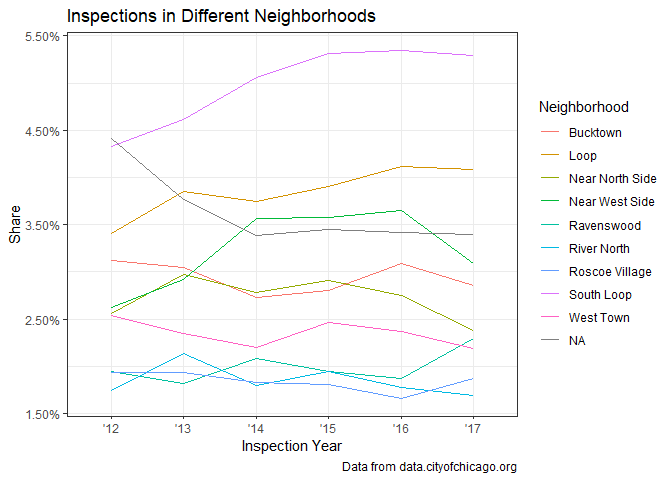<!-- -->


I looked at the Inspection Failure Rate in the Top 5 Neighborhoods. There is a definite increase in Fail Rate in **South Loop**. **Near West Side** saw a steep increase in 2014; more recently, it's showing a decreasing trend. 


```r
top_n_neighborhoods <- food_inspections_restaurants_df %>% 
  mutate(zip = as.character(zip)) %>% 
  left_join(chicago_neighborhoods_df, by = "zip") %>% 
  filter(results %in% c('Pass', 'Pass w/ Conditions', 'Fail'),
         ! risk %in% c('', 'All')) %>% 
  mutate(inspection_month = floor_date(inspection_date, unit = "month"),
         mth = month(inspection_month, label = TRUE),
         yr = paste0("'", year(inspection_month) %% 100)) %>% 
  group_by(neighborhood) %>% 
  summarise(total_inspections = n()) %>% 
  arrange(desc(total_inspections)) %>% 
  top_n(n=5)

food_inspections_restaurants_df %>% 
  mutate(zip = as.character(zip)) %>% 
  left_join(chicago_neighborhoods_df, by = "zip") %>% 
  filter(results %in% c('Pass', 'Pass w/ Conditions', 'Fail'),
         ! risk %in% c('', 'All')) %>% 
  mutate(inspection_month = floor_date(inspection_date, unit = "month"),
         mth = month(inspection_month, label = TRUE),
         yr = paste0("'", year(inspection_month) %% 100)) %>% 
  group_by(yr) %>% 
  mutate(total_inspections = n()) %>% 
  ungroup() %>% 
  group_by(neighborhood, yr) %>% 
  summarise(num_inspections = n(),
            num_fail = sum(ifelse(results == 'Fail', 1, 0)),
            num_pass = sum(ifelse(results == 'Pass', 1, 0)),
            num_pass_wc = sum(ifelse(results == 'Pass w/ Conditions', 1, 0)),
            total = num_fail+num_pass+num_pass_wc,
            pct = total/first(total_inspections),
            pass_rate = num_pass/total,
            fail_rate = num_fail/total,
            pass_wc_rate = num_pass_wc/total) %>% 
  filter(neighborhood %in% top_n_neighborhoods$neighborhood) %>% 
  ggplot(aes(x=yr, y = fail_rate))+
  geom_line(aes(color = neighborhood, group = neighborhood))+
  scale_y_continuous(labels = percent)+
  labs(title = "Failure Rate in Different Neighborhoods",
       caption = "Data from data.cityofchicago.org",
       x = "Inspection Year",
       y = "Percentage",
       color = "Neighborhood")+
  theme_bw()
```

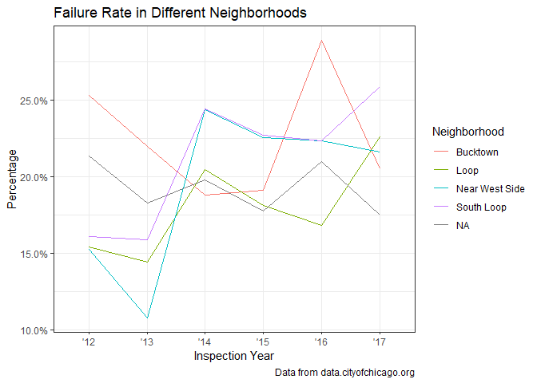<!-- -->

#### Conclusion

This whole exercise was a way for me to explore different plots and ways in which an RMarkdown document can be structured. It was a great opportunity to try out various things and a fantastic learning experience! Looking forward to more such exercises. 
